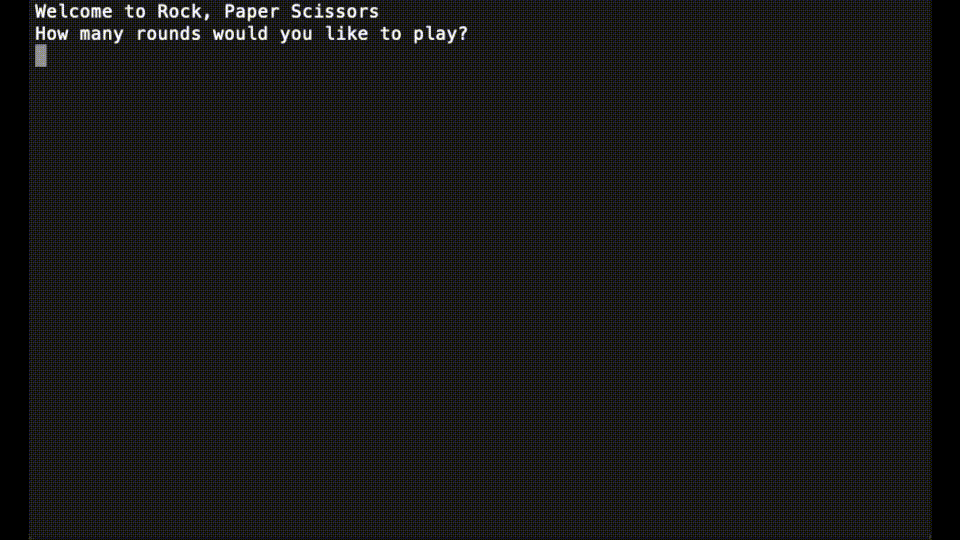

# Rock, Paper Scissors
A CLI app where the user can play a game of Rock, Paper, Scissors agains the computer.  The user can select how many rounds they would like play.  At the end, they are presented with how many wins, losses or ties they got.

## Project Walkthrough

### Technologies Used
* C#

## Author
* Clint Brodar
